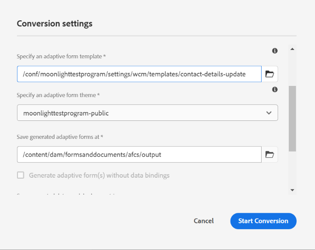

# PDF forms을 적응형 양식으로 전환 {#convert-print-forms-to-adaptive-forms}

Adobe Sensei에서 제공하는 AEM Forms AFCS(Automated Forms Conversion Service)는 PDF forms을 장치 친화적이고 반응형 적응형 양식<!--foundation and [core components](https://experienceleague.adobe.com/en/docs/experience-manager-core-components/using/adaptive-forms/introduction)-->(으)로 자동으로 변환합니다. 비대화형 PDF forms, Acro Forms 또는 XFA 기반 PDF forms을 사용하는 경우 AFCS(자동화된 양식 변환 서비스)는 이러한 양식을 적응형 양식으로 쉽게 변환할 수 있습니다. 기능, 전환 워크플로우 및 온보딩 정보에 대한 자세한 내용은 [자동 양식 전환](introduction.md) 서비스를 참조하십시오.

## 사전 요구 사항 {#pre-requisites}

* [**전환 서비스 구성**](configure-service.md)

* **변환된 양식에 적용할 [템플릿](https://helpx.adobe.com/experience-manager/6-5/forms/using/template-editor.html)을 준비하십시오.** 템플릿을 사용하면 모든 적응형 양식에 일관된 브랜딩을 적용할 수 있습니다. 또한 AFCS(Automated Forms Conversion Service)는 소스 PDF 문서의 머리글 및 바닥글을 추출하고 사용하지 않습니다. 적응형 양식 템플릿을 사용하여 머리글과 바닥글을 지정할 수 있습니다. 템플릿에 지정된 머리글과 바닥글은 전환 중에 적응형 양식에 적용됩니다. 서식 파일에 대한 폴더를 만들 때 모든 사용자에 대한 **[!UICONTROL Browse configurations]** 옵션을 선택하십시오.

* **전환된 양식에 적용할 [테마](https://helpx.adobe.com/experience-manager/6-5/forms/using/themes.html)를 준비하세요.** 테마를 사용하면 조직의 모든 적응형 양식에 일관된 스타일을 적용할 수 있습니다.

* **(선택 사항)** [**소스 PDF forms을 Adobe Sign 양식으로 변환**](frequently-asked-questions.md)

## 변환 프로세스 시작 {#start-the-conversion-process}

AEM 인스턴스를 AEM Forms 전환 서비스와 연결한 후 PDF forms을 적응형 양식으로 전환할 수 있습니다. 다음 단계를 나열된 순서로 수행하여 양식을 변환합니다.

* [AEM Forms 서버에 PDF forms 업로드](convert-existing-forms-to-adaptive-forms.md#upload-pdf-forms-to-your-aem-forms-server)
* [전환 실행](convert-existing-forms-to-adaptive-forms.md#run-the-conversion)
* [전환된 양식 검토 및 수정](review-correct-ui-edited.md)

### AEM Forms 서버에 PDF forms 업로드 {#upload-pdf-forms-to-your-aem-forms-server}

전환 서비스는 AEM Forms 인스턴스에서 사용할 수 있는 PDF forms을 적응형 양식으로 전환합니다. 필요에 따라 모든 PDF forms을 한 번에 또는 단계적으로 업로드할 수 있습니다. 양식을 업로드하기 전에 다음을 고려하십시오.

* 폴더의 양식 수를 15개 미만으로 유지하고 폴더의 총 페이지 수를 50개 미만으로 유지합니다.
* 폴더 크기를 10MB 미만으로 유지합니다. 양식을 하위 폴더에 보관하지 마십시오.
* 페이지 수를 15개 이하의 양식으로 유지합니다.
* 보호된 양식을 업로드하지 마십시오. 이 서비스는 암호로 보호되고 보안이 설정된 양식을 전환하지 않습니다.
* 파일 이름에 공백이 있는 소스 양식을 업로드하지 마십시오. 양식을 업로드하기 전에 파일 이름에서 공백을 제거합니다.
* [PDF 포트폴리오](https://helpx.adobe.com/acrobat/using/overview-pdf-portfolios.html)를 업로드하지 마십시오. 이 서비스는 PDF Portfolio을 적응형 양식으로 전환하지 않습니다.
* [알려진 문제](known-issues.md) 및 [모범 사례 및 고려 사항](styles-and-pattern-considerations-and-best-practices.md) 섹션을 읽고 양식에 대해 제안된 변경 사항을 적용하세요.

AEM Forms 인스턴스의 폴더로 변환할 양식을 업로드하려면 다음 단계를 수행하십시오.

1. AEM Forms 인스턴스에 로그인합니다.
1. **[!UICONTROL Adobe Experience Manager]**  > **[!UICONTROL Navigation]**  > **[!UICONTROL Forms]** > **[!UICONTROL Forms & Documents]**&#x200B;을 누릅니다.
1. **[!UICONTROL Create]**> **[!UICONTROL Folder]**&#x200B;을(를) 누릅니다. 폴더의 **제목** 및 **이름**&#x200B;을 지정하십시오. **[!UICONTROL Create]**&#x200B;을 누릅니다. 폴더가 생성됩니다.
1. 새로 만든 폴더를 열려면 탭하십시오.
1. **[!UICONTROL Create]**> **[!UICONTROL File Upload]**&#x200B;을(를) 누릅니다. 업로드할 양식을 선택하고 **[!UICONTROL Open]**&#x200B;을(를) 클릭한 다음 **[!UICONTROL Upload]**&#x200B;을(를) 클릭합니다. 양식이 업로드됩니다.

### 전환 실행 {#run-the-conversion}

양식을 업로드하고 서비스를 구성한 후 다음 단계를 수행하여 전환을 시작합니다.

1. AEM Forms 인스턴스에서 **[!UICONTROL Adobe Experience Manager]**  > **[!UICONTROL Navigation]**  > **[!UICONTROL Forms]** > **[!UICONTROL Forms & Documents]**&#x200B;을 누릅니다.
1. 양식 또는 PDF forms(변환할 양식)가 포함된 폴더를 선택하고 **[!UICONTROL Start Automated Conversion]**&#x200B;을(를) 누릅니다. **[!UICONTROL Conversion Settings]** 대화 상자가 나타납니다.

   

   **PDF를 적응형 양식 핵심 구성 요소로 변환**

    이 기능은 얼리 어답터 프로그램에서 제공됩니다. 공식 이메일 ID를 사용하여 aem-forms-ea@adobe.com으로 이메일을 보내 얼리 어답터 프로그램에 참여하고 기능에 대한 액세스 권한을 요청할 수 있습니다. 

   PDF forms을 기초 기반 양식으로 변환하려면 위의 변환 설정이 필요합니다. PDF 양식을 핵심 구성 요소 기반 적응형 양식으로 전환하려면 다음 작업을 수행하십시오.

   1. AEM Forms 인스턴스에서 [핵심 구성 요소](https://experienceleague.adobe.com/en/docs/experience-manager-core-components/using/adaptive-forms/introduction)를 활성화했는지 확인합니다. 활성화되지 않은 경우 [AEM 6.5](https://experienceleague.adobe.com/en/docs/experience-manager-65/content/forms/adaptive-forms-core-components/enable-adaptive-forms-core-components) 또는 [Cloud Service 환경](https://experienceleague.adobe.com/en/docs/experience-manager-cloud-service/content/forms/setup-configure-migrate/enable-adaptive-forms-core-components)에서 핵심 구성 요소를 활성화할 수 있습니다.
   1. 아래 이미지에 표시된 대로 [적응형 양식 템플릿 및 테마 기반의 핵심 구성 요소 선택](https://experienceleague.adobe.com/en/docs/experience-manager-core-components/using/adaptive-forms/sample-themes-templates-form-data-models-core-components):

      .
   1. PDF을 핵심 구성 요소 기반 양식으로 전환하려면 **[!UICONTROL Start Conversion]**&#x200B;을(를) 탭하세요.

   >[!NOTE]
   > * 핵심 구성 요소 기반 적응형 양식에는 데이터 바인딩 또는 데이터 모델 스키마와 같은 속성을 사용할 수 없지만 기초 구성 요소에는 동일한 속성을 사용할 수 있습니다.
   > * [변환된 양식을 검토하고 수정합니다](#review-and-correct-the-converted-forms)은(는) 핵심 구성 요소 기반 양식에 사용할 수 없습니다.

1. 전환 설정 대화 상자의 **[!UICONTROL Basic]** 탭에서:

   * **[!UICONTROL Select a cloud configuration]**. 구성을 선택하면 기본 템플릿과 테마가 이미 지정되었습니다. 필요한 경우 다른 템플릿 또는 테마를 지정할 수 있습니다.
   * 생성된 적응형 양식 및 해당 스키마를 저장할 위치를 지정하십시오. 기본 경로를 사용하거나 사용자 지정 경로를 지정할 수 있습니다.
   * 데이터 모델 바인딩이 있거나 없는 적응형 양식을 생성하려면 **데이터 모델 바인딩이 없는 적응형 양식 생성** 옵션을 사용하여 선택하십시오.
이 옵션을 선택하지 않으면 전환 서비스는 적응형 양식을 JSON 스키마와 자동으로 연결하고 적응형 양식에서 사용할 수 있는 필드와 JSON 스키마 사이에 데이터 바인딩을 만듭니다. **[!UICONTROL Save generated data model schema at]** 필드에 생성된 JSON 스키마를 저장할 기본 위치가 표시됩니다. 생성된 스키마를 저장하도록 위치를 사용자 지정할 수도 있습니다.
이 옵션을 선택하면 전환 서비스가 데이터 모델 바인딩 없이 적응형 양식을 생성합니다. 성공적으로 전환하면 적응형 양식을 양식 데이터 모델, XML 스키마 또는 JSON 스키마와 연결할 수 있습니다. 자세한 내용은 [적응형 양식 만들기](https://helpx.adobe.com/experience-manager/6-5/forms/using/creating-adaptive-form.html)를 참조하십시오.

   <!--

   Comment Type: draft

   <note type="note">
   
The XDP or XFA-based PDF form is not used to generate the Document of Record. The conversion service auto-generates the Document of Record only if you enable the Tools &gt; Cloud Services &gt; Automated Forms Conversion Configuration &gt; <strong>&lt;Properties of selected configuration&gt; &gt;</strong> Advanced &gt; Generate Document of Record option.

   
 

   </note>
   -->

1. 전환 설정 대화 상자의 **[!UICONTROL Additional]** 탭에서
   * 전환 서비스에서 전환된 양식의 양식 조각을 식별, 추출 및 다운로드하도록 하려면 **[!UICONTROL Extract fragment from adaptive forms]** 옵션을 선택하십시오. **[!UICONTROL Extract fragment from adaptive forms]** 옵션을 선택하면 추출된 양식 조각 및 해당 양식 조각 스키마를 저장하는 경로를 지정하는 옵션이 활성화됩니다.
   * 일부 기존 JSON 스키마 기반의 스키마와 적응형 양식 조각이 적은 스키마가 있고 이러한 조각을 자동으로 생성된 적응형 양식에서 사용할 계획인 경우 **[!UICONTROL existing adaptive form fragments]**&#x200B;의 위치를 지정하십시오. 전환 서비스는 사용 가능한 JSON 스키마 기반 및 스키마 적은 적응형 양식 조각을 입력 PDF forms(비대화형 PDF forms만 해당)와 일치시킵니다. 일치하는 항목이 있는 경우, 일치하는 적응형 양식 조각이 해당 적응형 양식에서 사용됩니다.

   >[!NOTE]
   >
   >
   > * 한 번에 **[!UICONTROL &#x200B; Extract Fragment]** 또는 **[!UICONTROL Use existing adaptive form fragments]** 옵션만 사용할 수 있습니다. 두 옵션을 동시에 사용할 수는 없습니다.
   > * **[!UICONTROL Use existing adaptive form fragments]** 옵션은 비대화형 PDF forms에서만 사용할 수 있습니다. 다른 양식 유형은 아직 지원되지 않습니다.
   > * 자동화된 전환 서비스를 사용하여 JSON 스키마에 바인딩된 바인딩되지 않은 조각 또는 조각만 사용할 수 있습니다. XFA 조각을 사용하지 마십시오. XFA 조각은 지원되지 않습니다.
   >

   * 데스크톱이나 노트북과 같은 대형 화면에 대해 원본 양식의 레이아웃을 유지하려면 **[!UICONTROL Auto-detect multi-column layout of input forms]** 옵션을 선택하십시오. 이 옵션은 소스 양식의 다중 열 레이아웃을 유지하는 데 유용합니다. 예를 들어 소스 PDF에 2열 레이아웃이 있는 경우 이 서비스는 대형 화면 디스플레이를 위한 2열 레이아웃과 휴대폰과 같은 소형 화면 장치를 위한 1열 레이아웃이 포함된 출력 적응형 양식을 생성합니다. 기능에 데이터 소스 스키마 구조와 관련된 몇 가지 알려진 문제가 있습니다. 자세한 내용은 [알려진 문제](known-issues.md) 문서를 참조하십시오.
   * 기본적으로 이 서비스를 통해 PDF 양식의 각 페이지마다 별도의 최상위 패널을 만들 수 있습니다. 이제 **[!UICONTROL Auto-detect logical sections]** 옵션을 사용하여 페이지 수준 패널(페이지 번호 기반 패널)을 만들지 않고 논리 패널만 만들 수 있습니다. 또한 이전 논리 섹션이 포함된 어떤 섹션에도 속하지 않는 필드와 두 장의 인접한 페이지에 걸쳐 있는 논리 섹션의 필드를 단일 논리 섹션으로 병합할 수 있습니다. 예를 들어, 논리 섹션의 일부 필드가 1페이지의 끝에 있고 일부는 2페이지의 시작에 있는 경우 그러한 모든 필드는 단일 논리 섹션으로 병합됩니다.

     >[!NOTE]
     > **[!UICONTROL Auto-detect logical sections]** 기능을 사용하려면 커넥터 패키지 1.1.38 이상이 필요합니다.

* (AEM Forms as a Cloud Service만 해당) [섹션을 조각으로 자동 변환] 옵션은 15페이지가 넘는 PDF forms에 적용됩니다. 감지된 최상위 섹션을 조각으로 변환합니다. 또한 생성된 모든 조각에 대해 지연 로드를 활성화합니다. 이를 사용하여 변환된 양식의 레더링 속도를 개선하고 적응형 양식 편집기에서 보다 쉽게 대용량 양식을 로드할 수 있습니다.

  >[!NOTE]
  > 섹션을 조각으로 자동 변환 옵션을 사용하는 동안 응답형 레이아웃 템플릿을 사용하지 마십시오.
  > 검토 및 수정 편집기를 사용하여 작은 패널을 큰 패널로 병합합니다. 변환된 적응형 양식의 조각 수를 줄이는 데 도움이 됩니다.
  > &quot;너무 많은 호출&quot; 예외가 발생하는 경우
  >
  > * 간소화된 계층 구조를 만들기 위해 양식 재구성
  > * [예외가 사라질 때까지 sling.max.calls 매개 변수의 값을 충분히 높은 수로 늘립니다].
  > * [캐시의 크기를 늘립니다](https://experienceleague.adobe.com/docs/experience-manager-65/forms/install-aem-forms/configure-aem-forms/configure-adaptive-forms-cache.html). 양식이 너무 복잡하고 표의 수가 많으며 여러 수준의 계층 구조를 사용하는 경우 오류가 발생합니다.

1. **[!UICONTROL Start Conversion]**&#x200B;을 누릅니다. 전환이 시작되었습니다. 전환이 진행될 때까지 폴더 또는 양식에 전환 진행률이 표시됩니다. 전환이 완료된 후 메시지가 다른 상태 메시지(전환됨, 부분적으로 전환됨 또는 전환 실패)로 바뀝니다. 전환 완료 시 구성된 이메일 주소에서도 상태 이메일이 전송됩니다.

   * 전환이 성공하면 전환된 적응형 양식 및 관련 스키마가 전환 대화 상자의 **[!UICONTROL Basic]** 탭에 지정된 경로로 다운로드됩니다. 양식 조각 및 해당 스키마는 전환을 시작하기 전에 조각 추출 옵션을 선택한 경우에만 다운로드됩니다.
   * 변환 실패 시 모든 입력 양식이 변환되지 않는 경우 **[!UICONTROL Conversion Failed]** 메시지가 표시되고, 일부 입력 양식만 변환되지 않는 경우 **[!UICONTROL Partially Failed]** 메시지가 표시됩니다. [구성된 전자 메일 주소](configure-service.md#configureemailnotification)에서 상태 전자 메일이 전송되며 오류가 error.log 파일에 기록됩니다.

   에서 XFA 기반 PDF 양식을 적응형 양식으로 전환하는 경우 전환 서비스는 PDF 양식을 기록 문서 템플릿으로 변환된 적응형 양식에 자동으로 연결합니다. 변환 후 적응형 양식 속성을 열어 **[!UICONTROL Form Model]** 탭의 **[!UICONTROL Document of Record Template Configuration]** 섹션에서 기록 문서 템플릿을 볼 수 있습니다.  

   **[!UICONTROL Tools]** > **[!UICONTROL Cloud Services]** > **[!UICONTROL Automated Forms Conversion Configuration]** > **[!UICONTROL Properties of selected configuration]** > **[!UICONTROL Advanced]** > **[!UICONTROL Generate Document of Record]** 옵션을 사용하도록 설정하는 경우에만 변환 서비스에서 변환된 적응형 양식에 PDF 양식을 기록 문서 템플릿으로 자동으로 업로드합니다.

   <!--

   Comment Type: draft

   <note type="note">
   
By default, the adaptive form produces a JSON schema instead of XML schema on submission. JSON schema of a converted adaptive form is complaint with XML schema of an XFA-based form. You can use the <a href="https://sling.apache.org/apidocs/sling5/org/apache/sling/commons/json/xml/XML.html#toString">org.apache.sling.commons.json.xml API</a> to convert a JSON schema to XML schema. You can also use the following sample code for conversion:

   
<code class="code">import org.apache.sling.commons.json.JSONException;
   <discoiqbr /> import org.apache.sling.commons.json.JSONObject;
   <discoiqbr /> import org.apache.sling.commons.json.xml.XML;
   <discoiqbr />
   <discoiqbr /> public class ConversionUtils {
   <discoiqbr />
   <discoiqbr /> public static String jsonToXML(String jsonString) throws JSONException {
   <discoiqbr /> //https://sling.apache.org/apidocs/sling5/org/apache/sling/commons/json/xml/XML.html#toString(java.lang.Object)
   <discoiqbr /> //jar - http://maven.ibiblio.org/maven2/org/apache/sling/org.apache.sling.commons.json/2.0.18/
   <discoiqbr /> //Note: Need to extract boundData part before converting to XML
   <discoiqbr /> return XML.toString(new JSONObject(jsonString));
   <discoiqbr /> }
   <discoiqbr /> }</code>  

   </note>
   -->

   >[!NOTE]
   >
   >전환 프로세스가 60분 이상 소요되고 PDF 양식이 적응형 양식으로 전환되지 않는 경우 AEM Forms 인스턴스에 폴더를 만들고 PDF 양식을 새로 만든 폴더에 업로드한 다음 전환을 다시 시작합니다.

## 전환된 양식 검토 및 수정 {#review-and-correct-the-converted-forms}

실제 양식에는 복잡한 데이터 캡처 요구 사항이 있습니다. 자동 전환이 완료되면 고객은 양식의 전환 품질을 검토하고 양식에 필요한 업데이트를 수행할 수 있습니다. AEM Forms은 필요한 변경을 수행하기 위해 [검토 및 수정](review-correct-ui-edited.md) 편집기를 제공합니다. 이를 통해 양식 필드의 자동 식별을 개선하고 식별된 필드를 한 유형에서 다른 유형으로 변환할 수 있습니다. 예를 들어, 양식의 2열 레이아웃을 식별하고 라디오 단추로 자동으로 식별된 필드를 다중 선택 필드로 변경하는 데 도움이 될 수 있습니다.
