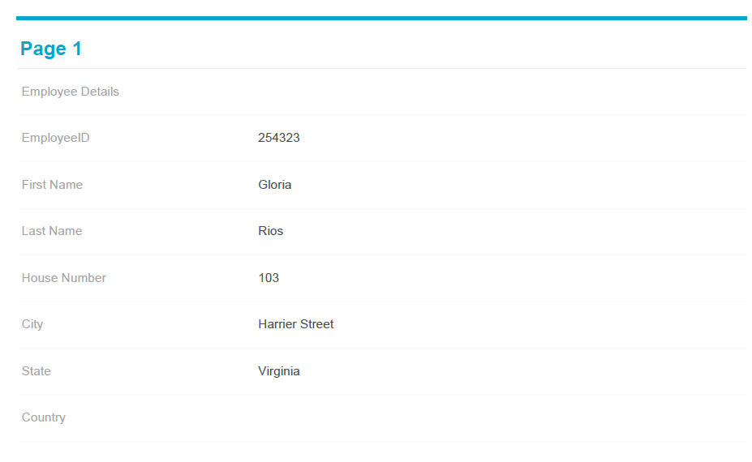
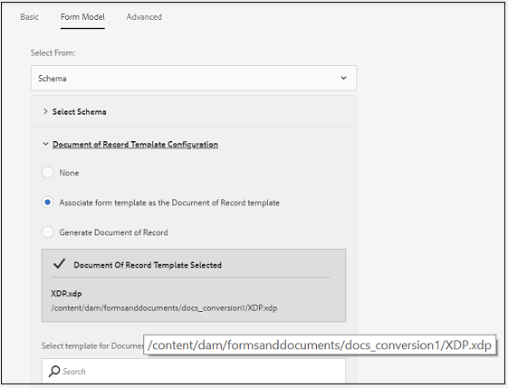

# 적응형 양식의 기록 문서 생성 활성화를 위한 권장 워크플로우 {#recommended-workflows-dor-generation}

기록 문서(DoR)를 사용하면 제공한 정보를 기록하고 적응형 양식에 제출하여 나중에 참조할 수 있습니다.
DoR은 기본 템플릿을 사용하여 레이아웃을 정의합니다. 기본 템플릿을 사용하거나 다른 템플릿을 적응형 양식과 연결하여 DoR을 생성할 수 있습니다.

DoR 생성에 대한 자세한 내용은 [적응형 양식에 대한 기록 문서 생성](https://helpx.adobe.com/experience-manager/6-5/forms/using/generate-document-of-record-for-non-xfa-based-adaptive-forms.html)을 참조하십시오.

[AFCS(Automated forms conversion 서비스)](/help/using/introduction.md)이(가) 다음 원본 양식을 적응형 양식으로 전환합니다.

* 비대화형 PDF forms
* 아크로 Forms
* XFA 기반 PDF forms

변환에 사용하는 소스 양식을 기반으로 다음을 사용하여 DoR을 생성할 수 있습니다.

* 기본 템플릿
* 소스 양식을 템플릿으로 연결 - 이 옵션을 선택하면 변환 서비스에서 소스 양식을 변환된 적응형 양식과 DoR 템플릿으로 자동 연결합니다.
* 다른 템플릿을 변환된 적응형 양식과 연결

다음 표에서는 사용하는 DoR 템플릿이 생성된 DoR의 레이아웃에 미치는 영향의 예를 보여 줍니다.

<table> 
 <tbody>
 <tr>
  <td>
<strong>Source 양식</strong>
</td>
  <td>
<strong>생성된 DoR</strong>
</td> 
   </tr>
  <tr>
   <td></td>
   <td>
기본 템플릿을 사용하여 DoR을 생성하는 경우: </td>
   </tr>
   <tr>
   <td></td>
   <td>
소스 양식을 템플릿으로 사용하여 DoR을 생성하는 경우: 
</td>
   </tr>
  </tbody>
</table>

표에 표시된 대로 소스 양식을 템플릿으로 사용하는 경우 DoR은 소스 양식의 레이아웃을 유지합니다.
이 문서에서는 세 가지 유형의 소스 양식을 기반으로 DoR을 생성하는 권장 경로에 대해 설명합니다.

<table> 
 <tbody> 
  <tr> 
   <th><strong>Source 양식</strong></th> 
   <th><strong>DoR 생성 방법</strong></th> 
  </tr> 
  <tr> 
   <td>
비대화형 PDF forms
</td> 
   <td> 
    <ul> 
     <li><a href="#generate-document-of-record-using-cloud-configuration">적응형 양식 변환 전에 DoR 생성을 활성화하여 기본 템플릿을 사용하여 DoR을 생성합니다.</a></li> 
     <li><a href="#edit-adaptive-form-properties-generate-document-of-record">적응형 양식 전환 후 적응형 양식 속성을 편집하여 기본 또는 기타 양식 템플릿을 사용한 DoR 생성 활성화</a></li> 
    </ul> </td> 
  </tr>
  <tr> 
   <td>
Acro Forms 또는 XFA 기반 PDF forms
</td> 
   <td> 
    <ul> 
     <li><a href="#use-input-form-as-template-to-generate-document-of-record">적응형 양식 변환 전 DoR 생성을 활성화하여 소스 양식을 템플릿으로 사용하는 DoR 생성</a></li> 
     <li><a href="#edit-adaptive-form-properties-to-generate-document-of-record">적응형 양식 전환 후 적응형 양식 속성을 편집하여 기본 템플릿, 소스 양식을 템플릿으로 또는 기타 양식 템플릿을 사용하여 DoR 생성 가능</a></li> 
    </ul> </td> 
  </tr>    
 </tbody> 
</table>

## 비대화형 PDF forms에 대한 기록 문서 생성 {#generate-document-of-record-non-interactive-pdf}

비대화형 PDF 양식을 Automated forms conversion 서비스(AFCS)의 소스 양식으로 사용하는 경우 다음을 수행할 수 있습니다.

* 적응형 양식 변환 전에 DoR 생성을 활성화하여 기본 템플릿을 사용하여 DoR을 생성합니다.
* 또는 적응형 양식 전환 후 적응형 양식 속성을 편집하여 기본 또는 기타 양식 템플릿을 사용한 DoR 생성 가능

### 변환 전 DoR 생성을 활성화하여 기본 템플릿을 사용하여 DoR 생성 {#generate-document-of-record-using-cloud-configuration}

1. **[!UICONTROL Tools]** > **[!UICONTROL Cloud Services]** > **[!UICONTROL Automated Forms Conversion Configuration]** > 전환에 사용되는 클라우드 구성의 속성 > **[!UICONTROL Advanced]** > **[!UICONTROL Generate Document of Record]** 옵션을 선택합니다.

   

1. 설정을 저장하려면 **[!UICONTROL Save & Close]**&#x200B;을(를) 탭하세요.

1. [변환 실행](/help/using/convert-existing-forms-to-adaptive-forms.md). 이 지침 중 1단계에서 편집한 클라우드 구성을 사용해야 합니다.
변환된 적응형 양식을 제출하면 기본 템플릿을 사용하여 DoR이 자동으로 생성됩니다.

### 전환 후 적응형 양식 속성을 편집하여 DoR 생성 활성화 {#edit-adaptive-form-properties-generate-document-of-record}

에서 소스 양식을 적응형 양식으로 변환하기 전에 DoR 생성을 활성화하지 않으면 변환 후에도 활성화할 수 있습니다.

1. 적응형 양식을 생성하려면 비대화형 PDF 양식에서 [전환을 실행](/help/using/convert-existing-forms-to-adaptive-forms.md)하십시오.

1. **[!UICONTROL output]** 폴더에서 적응형 양식을 선택하고 **[!UICONTROL Properties]**&#x200B;을(를) 누릅니다.

1. **[!UICONTROL Form Model]** 탭에서 **[!UICONTROL Document of Record Template Configuration]** 섹션을 확장하고 **[!UICONTROL Generate Document of Record]**&#x200B;을(를) 선택합니다.

   

1. 설정을 저장하려면 **[!UICONTROL Save & Close]**&#x200B;을(를) 탭하세요.

변환된 적응형 양식을 제출하면 기본 템플릿을 사용하여 DoR이 자동으로 생성됩니다. 다른 DoR 템플릿을 변환된 적응형 양식과 연결하려면 **[!UICONTROL Associate form template as the Document of Record template]** 옵션을 선택할 수 있습니다.

## Acro Forms 또는 XFA 기반 PDF forms에 대한 기록 문서 생성 {#generate-document-of-record-acroform-xfaform}

Acro 양식 또는 XFA 기반 PDF 양식을 AFCS(Automated forms conversion 서비스)의 소스 양식으로 사용하는 경우 다음을 수행할 수 있습니다.

* 적응형 양식 변환 전에 DoR 생성을 활성화하여 소스 양식을 템플릿으로 사용하는 DoR을 생성합니다.

* 또는 적응형 양식 전환 후 적응형 양식 속성을 편집하여 기본 템플릿, 소스 양식을 템플릿으로 또는 기타 양식 템플릿을 사용하여 DoR 생성 가능

### 변환 전 DoR 생성을 활성화하여 소스 양식 템플릿을 사용하여 DoR 생성 {#use-input-form-as-template-to-generate-document-of-record}

1. **[!UICONTROL Tools]** > **[!UICONTROL Cloud Services]** > **[!UICONTROL Automated Forms Conversion Configuration]** > 전환에 사용되는 클라우드 구성의 속성 > **[!UICONTROL Advanced]** > **[!UICONTROL Generate Document of Record]** 옵션을 선택합니다.

1. 설정을 저장하려면 **[!UICONTROL Save & Close]**&#x200B;을(를) 탭하세요.

1. [변환 실행](/help/using/convert-existing-forms-to-adaptive-forms.md). 이 지침 중 1단계에서 편집한 클라우드 구성을 사용해야 합니다.
변환 서비스는 Acro 양식 또는 XFA 기반 PDF 양식을 변환된 적응형 양식에 DoR 템플릿으로 자동 연결합니다.
적응형 양식 속성을 열어 **[!UICONTROL Form Model]** 탭의 **[!UICONTROL Document of Record Template Configuration]** 섹션에서 DoR 템플릿을 볼 수 있습니다.

   

   변환된 적응형 양식을 제출하면 소스 양식 템플릿을 사용하여 DoR이 자동으로 생성됩니다.

### 전환 후 적응형 양식 속성을 편집하여 DoR 생성 활성화 {#edit-adaptive-form-properties-to-generate-document-of-record}

1. 적응형 양식을 생성하려면 비대화형 PDF 양식에서 [전환을 실행](/help/using/convert-existing-forms-to-adaptive-forms.md)하십시오.

1. **[!UICONTROL output]** 폴더에서 적응형 양식을 선택하고 **[!UICONTROL Properties]**&#x200B;을(를) 누릅니다.

1. **[!UICONTROL Form Model]** 탭에서 **[!UICONTROL Document of Record Template Configuration]** 섹션을 확장하고 **[!UICONTROL Generate Document of Record]**&#x200B;을(를) 선택하여 기본 템플릿을 사용하여 DoR 생성을 사용하도록 설정합니다.
**[!UICONTROL Associate form template as the Document of Record template]** 옵션을 선택하고 템플릿을 선택하여 소스 양식 템플릿 또는 다른 양식 템플릿을 사용하여 DoR 생성을 활성화할 수도 있습니다.

1. 설정을 저장하려면 **[!UICONTROL Save & Close]**&#x200B;을(를) 탭하세요.
