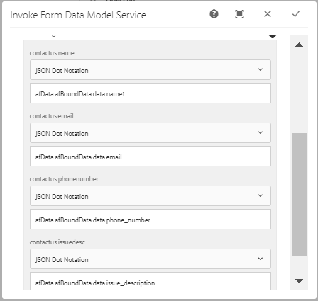

# AEM 워크플로우를 사용하여 적응형 양식과 데이터베이스 통합 {#submit-forms-to-database-using-forms-portal}

AFCS(automated forms conversion 서비스)를 사용하면 비대화형 PDF 양식, Acro 양식 또는 XFA 기반 PDF 양식을 적응형 양식으로 변환할 수 있습니다. 변환 프로세스를 시작하는 동안 데이터 바인딩을 사용하거나 사용하지 않고 적응형 양식을 생성할 수 있습니다.

데이터 바인딩 없이 적응형 양식을 생성하도록 선택한 경우, 변환된 적응형 양식을 변환 후 양식 데이터 모델, XML 스키마 또는 JSON 스키마와 통합할 수 있습니다. 양식 데이터 모델의 경우 적응형 양식 필드를 양식 데이터 모델에 수동으로 바인딩해야 합니다. 그러나 데이터 바인딩이 있는 적응형 양식을 생성하는 경우 전환 서비스는 적응형 양식을 JSON 스키마와 자동으로 연결하고 적응형 양식에서 사용할 수 있는 필드와 JSON 스키마 사이에 데이터 바인딩을 만듭니다. 그런 다음 적응형 양식을 선택한 데이터베이스와 통합하고 양식에 데이터를 입력한 다음 데이터베이스에 제출할 수 있습니다. 마찬가지로 데이터베이스와 통합한 후 변환된 적응형 양식의 필드를 구성하여 데이터베이스에서 값을 검색하고 적응형 양식 필드를 미리 채울 수 있습니다.

다음 그림은 변환된 적응형 양식을 데이터베이스와 통합하는 여러 단계를 보여 줍니다.


이 문서에서는 이러한 모든 통합 단계를 성공적으로 실행하기 위한 단계별 지침을 설명합니다.

## 전제 조건 {#pre-requisites}

* AEM 6.4 또는 6.5 작성자 인스턴스 설정
* AEM 인스턴스에 대해 [최신 서비스 팩](https://helpx.adobe.com/kr/experience-manager/aem-releases-updates.html) 설치
* 최신 버전의 AEM Forms 추가 기능 패키지
* [Automated forms conversion 서비스 구성](configure-service.md)
* 데이터베이스를 설정합니다. 샘플 구현에 사용되는 데이터베이스는 MySQL 5.6.24입니다. 그러나 변환된 적응형 양식을 원하는 데이터베이스와 통합할 수 있습니다.

## 샘플 적응형 양식 {#sample-adaptive-form}

AEM 워크플로를 사용하여 변환된 적응형 양식을 데이터베이스와 통합하는 사용 사례를 실행하려면 다음 샘플 PDF 파일을 다운로드하십시오.

다음을 사용하여 샘플 연락처 양식을 다운로드할 수 있습니다.

[파일 가져오기](assets/sample_contact_us_form.pdf)

PDF 파일은 Automated forms conversion 서비스(AFCS)에 대한 입력 역할을 합니다. 이 서비스는 이 파일을 적응형 양식으로 전환합니다. 다음 이미지는 PDF 형식의 샘플 연락처 양식을 보여 줍니다.


## mysql-connector-java-5.1.39-bin.jar 파일 설치 {#install-mysql-connector-java-file}

모든 작성자 및 게시 인스턴스에서 다음 단계를 수행하여 mysql-connector-java-5.1.39-bin.jar 파일을 설치합니다.

1. `http://server:port/system/console/depfinder`(으)로 이동하여 com.mysql.jdbc 패키지를 검색합니다.
1. 내보낸 사람 열에서 패키지를 번들로 내보내는지 확인합니다. 번들로 패키지를 내보내지 않는 경우 계속 진행합니다.
1. `http://server:port/system/console/bundles`(으)로 이동하여 **[!UICONTROL Install/Update]**&#x200B;을(를) 클릭합니다.
1. **[!UICONTROL Choose File]**&#x200B;을(를) 클릭하고 mysql-connector-java-5.1.39-bin.jar 파일을 찾아 선택합니다. **[!UICONTROL Start Bundle]** 및 **[!UICONTROL Refresh Packages]**&#x200B;개의 확인란도 선택하십시오.
1. **[!UICONTROL Install]** 또는 **[!UICONTROL Update]**&#x200B;을(를) 클릭합니다. 완료되면 서버를 다시 시작합니다.
1. (Windows 전용) 운영 체제에 대한 시스템 방화벽을 끕니다.

## 양식 모델을 위한 데이터 준비 {#prepare-data-for-form-model}

AEM Forms 데이터 통합을 사용하면 서로 다른 데이터 소스를 구성하고 연결할 수 있습니다. 전환 프로세스를 사용하여 적응형 양식을 생성한 후 양식 데이터 모델, XSD 또는 JSON 스키마를 기반으로 양식 모델을 정의할 수 있습니다. 데이터베이스, Microsoft Dynamics 또는 기타 서드파티 서비스를 사용하여 양식 데이터 모델을 만들 수 있습니다.

이 자습서에서는 MySQL 데이터베이스를 소스로 사용하여 양식 데이터 모델을 만듭니다. 데이터베이스에 스키마를 만들고 적응형 양식에서 사용할 수 있는 필드를 기반으로 스키마에 **연락처** 테이블을 추가하십시오.


다음 DDL 문을 사용하여 데이터베이스에 **contactus** 테이블을 만들 수 있습니다.

```sql
CREATE TABLE `contactus` (
   `name` varchar(45) NOT NULL,
   `email` varchar(45) NOT NULL,
   `phonenumber` varchar(10) DEFAULT NULL,
   `issuedesc` varchar(1000) DEFAULT NULL,
   PRIMARY KEY (`email`)
 ) ENGINE=InnoDB DEFAULT CHARSET=utf8
```

## AEM 인스턴스와 데이터베이스 간의 연결 구성 {#configure-connection-between-aem-instance-and-database}

AEM 인스턴스와 MYSQL 데이터베이스 간에 연결을 만들려면 다음 구성 단계를 수행하십시오.

1. `http://server:port/system/console/configMgr`의 AEM 웹 콘솔 구성 페이지로 이동합니다.
1. 웹 콘솔 구성에서 **[!UICONTROL Apache Sling Connection Pooled DataSource]**&#x200B;을(를) 찾아 클릭하여 편집 모드로 엽니다. 다음 표에 설명된 대로 등록 정보 값을 지정합니다.

   <table> 
    <tbody> 
    <tr> 
    <th><strong>속성</strong></th> 
    <th><strong>값</strong></th> 
    </tr> 
    <tr> 
    <td><p>데이터 소스 이름</p></td> 
    <td><p>데이터 소스 풀에서 드라이버를 필터링하기 위한 데이터 소스 이름입니다.</p></td>
    </tr>
    <tr> 
    <td><p>JDBC 드라이버 클래스</p></td> 
    <td><p>com.mysql.jdbc.Driver</p></td>
    </tr>
    <tr> 
    <td><p>JDBC 연결 URI</p></td> 
    <td><p>jdbc:mysql://[host]:[port]/[schema_name]</p></td>
    </tr>
    <tr> 
    <td><p>사용자 이름</p></td> 
    <td><p>데이터베이스 테이블에 대해 인증하고 작업을 수행할 사용자 이름</p></td>
    </tr>
    <tr> 
    <td><p>암호</p></td> 
    <td><p>사용자 이름과 연계된 암호</p></td>
    </tr>
    <tr> 
    <td><p>트랜잭션 격리</p></td> 
    <td><p>READ_COMMIT</p></td>
    </tr>
    <tr> 
    <td><p>최대 활성 연결</p></td> 
    <td><p>1000년</p></td>
    </tr>
    <tr> 
    <td><p>최대 유휴 연결</p></td> 
    <td><p>100</p></td>
    </tr>
    <tr> 
    <td><p>최소 유휴 연결</p></td> 
    <td><p>10</p></td>
    </tr>
    <tr> 
    <td><p>초기 크기</p></td> 
    <td><p>10</p></td>
    </tr>
    <tr> 
    <td><p>최대 대기</p></td> 
    <td><p>100000</p></td>
    </tr>
     <tr> 
    <td><p>차입 시 테스트</p></td> 
    <td><p>선택됨</p></td>
    </tr>
     <tr> 
    <td><p>유휴 상태 테스트</p></td> 
    <td><p>선택됨</p></td>
    </tr>
     <tr> 
    <td><p>유효성 검사 쿼리</p></td> 
    <td><p>값의 예로는 SELECT 1(mysql), select 1 from dual(oracle), SELECT 1(MS Sql Server)(validationQuery)이 있습니다.</p></td>
    </tr>
     <tr> 
    <td><p>유효성 검사 쿼리 시간 초과</p></td> 
    <td><p>10000</p></td>
    </tr>
    </tbody> 
    </table>

## 양식 데이터 모델 만들기 {#create-form-data-model}

MYSQL을 데이터 소스로 구성했으면 다음 단계를 실행하여 양식 데이터 모델을 생성합니다.

1. AEM 작성자 인스턴스에서 **[!UICONTROL Forms]** > **[!UICONTROL Data Integrations]**(으)로 이동합니다.

1. **[!UICONTROL Create]** > **[!UICONTROL Form Data Model]**&#x200B;을(를) 누릅니다.

1. **[!UICONTROL Create Form Data Model]** 마법사에서 양식 데이터 모델의 이름으로 **workflow_submit**&#x200B;을(를) 지정합니다. **[!UICONTROL Next]**&#x200B;을(를) 누릅니다.

1. 이전 섹션에서 구성한 MYSQL 데이터 원본을 선택하고 **[!UICONTROL Create]**&#x200B;을(를) 누릅니다.

1. **[!UICONTROL Edit]**&#x200B;을(를) 탭하고 왼쪽 창에 나열된 데이터 원본을 확장하여 **연락처** 테이블, **[!UICONTROL get]** 및 **[!UICONTROL insert]** 서비스를 선택한 다음 **[!UICONTROL Add Selected]**&#x200B;을(를) 탭합니다.

   

1. 오른쪽 창에서 데이터 모델 개체를 선택하고 **[!UICONTROL Edit Properties]**&#x200B;을(를) 누릅니다. **[!UICONTROL Read Service]** 및 **[!UICONTROL Write Service]** 드롭다운 목록에서 **[!UICONTROL get]** 및 **[!UICONTROL insert]** 선택 읽기 서비스의 인수를 지정하고 **[!UICONTROL Done]**&#x200B;을(를) 누릅니다.

1. **[!UICONTROL Services]** 탭에서 **[!UICONTROL get]** 서비스를 선택하고 **[!UICONTROL Edit Properties]**&#x200B;을(를) 누릅니다. **[!UICONTROL Output Model Object]**&#x200B;을(를) 선택하고 **[!UICONTROL Return array]** 전환을 사용하지 않도록 설정한 다음 **[!UICONTROL Done]**&#x200B;을(를) 탭합니다.

1. **[!UICONTROL Insert]** 서비스를 선택하고 **[!UICONTROL Edit Properties]**&#x200B;을(를) 누릅니다. **[!UICONTROL Input Model Object]**&#x200B;을(를) 선택하고 **[!UICONTROL Done]**&#x200B;을(를) 누릅니다.

1. 양식 데이터 모델을 저장하려면 **[!UICONTROL Save]**&#x200B;을(를) 탭하세요.

다음을 사용하여 샘플 양식 데이터 모델을 다운로드할 수 있습니다.

[파일 가져오기](assets/DownloadedFormsPackage_1497728018502500.zip)

## JSON 바인딩을 사용하여 적응형 양식 생성 {#generate-adaptive-forms-with-json-binding}

[Automated forms conversion 서비스(AFCS)를 사용하여 [연락처 양식](#sample-adaptive-form)을(를) 데이터 바인딩이 있는 적응형 양식으로 변환](convert-existing-forms-to-adaptive-forms.md)할 수 있습니다. 적응형 양식을 생성하는 동안 **[!UICONTROL Generate adaptive form(s) without data bindings]** 확인란을 선택하지 마십시오.


**[!UICONTROL Forms & Documents]**&#x200B;의 **[!UICONTROL output]** 폴더에서 사용 가능한 전환된 **연락처 양식**&#x200B;을 선택하고 **[!UICONTROL Edit]**&#x200B;을(를) 누릅니다. **[!UICONTROL Preview]**&#x200B;을(를) 누르고 적응형 양식 필드에 값을 입력한 다음 **[!UICONTROL Submit]**&#x200B;을(를) 누릅니다.

**crx-repository**&#x200B;에 로그온한 다음 */content/forms/fp/admin/submit/data*(으)로 이동하여 JSON 형식으로 제출된 값을 확인합니다. 다음은 변환된 **연락처** 적응형 양식을 제출할 때 JSON 형식의 샘플 데이터입니다.

```json
{
  "afData": {
    "afUnboundData": {
      "data": {}
    },
    "afBoundData": {
      "data": {
        "name1": "Gloria",
        "email": "abc@xyz.com",
        "phone_number": "2346578965",
        "issue_description": "Test message"
      }
    },
    "afSubmissionInfo": {
      "computedMetaInfo": {},
      "stateOverrides": {},
      "signers": {},
      "afPath": "/content/dam/formsanddocuments/docs_conversion/output/sample_form_json",
      "afSubmissionTime": "20191204014007"
    }
  }
}
```

이제 이전 섹션에서 만든 양식 데이터 모델을 사용하여 이 데이터를 처리하고 MYSQL 데이터베이스에 제출할 수 있는 워크플로우 모델을 만들어야 합니다.

## JSON 데이터를 처리할 워크플로우 모델 만들기 {#create-workflow-model}

다음 단계를 실행하여 적응형 양식 데이터를 데이터베이스에 제출할 워크플로우 모델을 생성합니다.

1. 워크플로우 모델 콘솔을 엽니다. 기본 URL은 `https://server:port/libs/cq/workflow/admin/console/content/models.html/etc/workflow/models`입니다.

1. **[!UICONTROL Create]**&#x200B;을(를) 선택한 다음 **[!UICONTROL Create Model]**&#x200B;을(를) 선택합니다. **[!UICONTROL Add Workflow Model]** 대화 상자가 나타납니다.

1. **[!UICONTROL Title]** 및 **[!UICONTROL Name]**&#x200B;을(를) 입력하십시오(선택 사항). 예: **workflow_json_submit**. 모델을 만들려면 **[!UICONTROL Done]**&#x200B;을(를) 탭하세요.

1. 워크플로우 모델을 선택하고 **[!UICONTROL Edit]**&#x200B;을(를) 탭하여 편집 모드로 모델을 엽니다. +를 누르고 워크플로 모델에 **[!UICONTROL Invoke Form Data Model Service]** 단계를 추가합니다.

1. **[!UICONTROL Invoke Form Data Model Service]** 단계를 누르고 을 누릅니다.

1. **[!UICONTROL Form Data Model]** 탭에서 **[!UICONTROL Form Data Model path]** 필드에서 만든 양식 데이터 모델을 선택하고 **[!UICONTROL Service]** 드롭다운 목록에서 **[!UICONTROL insert]**&#x200B;을(를) 선택합니다.

1. **[!UICONTROL Input for Service]** 탭의 드롭다운 목록에서 **[!UICONTROL Provide input data using literal, variable, or a workflow metadata, and a JSON file]**&#x200B;을(를) 선택하고 **[!UICONTROL Map input fields from input JSON]** 확인란을 선택한 다음 **[!UICONTROL Relative to payload]**&#x200B;을(를) 선택하고 **[!UICONTROL Select input JSON document using]** 필드의 값으로 **data.xml**&#x200B;을(를) 제공합니다.

1. **[!UICONTROL Service Arguments]** 섹션에서 양식 데이터 모델 인수에 대해 다음 값을 제공합니다.

   

   양식 데이터 모델 필드(예: contactus 점 이름)는 제출된 적응형 양식에 대한 JSON 스키마 바인딩을 참조하는 **afData.afBoundData.data.name1**&#x200B;에 매핑됩니다.

## 적응형 양식 제출 구성 {#configure-adaptive-form-submission}

다음 단계를 실행하여 적응형 양식을 이전 섹션에서 만든 워크플로우 모델에 제출합니다.

1. **[!UICONTROL Forms & Documents]**&#x200B;의 **[!UICONTROL output]** 폴더에서 사용할 수 있는 전환된 연락처 양식을 선택하고 **[!UICONTROL Edit]**&#x200B;을(를) 누릅니다.

1. **[!UICONTROL Form Container]**&#x200B;을(를) 탭한 다음 을(를) 탭하여 적응형 양식 속성을 엽니다.

1. **[!UICONTROL Submission]** 섹션의 **[!UICONTROL Submit Action]** 드롭다운 목록에서 **[!UICONTROL Invoke an AEM workflow]**&#x200B;을(를) 선택하고 이전 섹션에서 만든 워크플로 모델을 선택한 다음 **[!UICONTROL Data File Path]** 필드에 **data.xml**&#x200B;을(를) 지정합니다.

1. 을 탭하여 변경 내용을 저장합니다.

1. **[!UICONTROL Preview]**&#x200B;을(를) 누르고 적응형 양식 필드에 값을 입력한 다음 **[!UICONTROL Submit]**&#x200B;을(를) 누릅니다. 이제 제출된 값이 **crx-repository** 대신 MYSQL 데이터베이스 테이블에 표시됩니다.

## 데이터베이스의 값을 미리 채우도록 적응형 양식 구성

다음 단계를 실행하여 테이블에 정의된 기본 키(이 경우 전자 메일)를 기반으로 MYSQL 데이터베이스의 값을 미리 채우도록 적응형 양식을 구성합니다.

1. 적응형 양식에서 **전자 메일** 필드를 탭하고 을 탭합니다.

1. **[!UICONTROL Create]**&#x200B;을(를) 탭하고 **[!UICONTROL When]** 섹션의 **[!UICONTROL Select State]** 드롭다운 목록에서 **[!UICONTROL is changed]**&#x200B;을(를) 선택합니다.

1. **[!UICONTROL Then]** 섹션에서 이 문서의 이전 섹션에서 만든 양식 데이터 모델에 대한 서비스로 **[!UICONTROL Invoke Service]** 및 **get**&#x200B;을(를) 선택합니다.

1. **[!UICONTROL Input]** 섹션에서 **전자 메일**&#x200B;을(를) 선택하고 **[!UICONTROL Output]** 섹션에서 양식 데이터 모델의 나머지 세 필드, **이름**, **전화 번호** 및 **문제 설명**&#x200B;을(를) 선택하십시오. 설정을 저장하려면 **[!UICONTROL Done]**&#x200B;을(를) 탭하세요.

   

   따라서 MYSQL 데이터베이스의 기존 전자 메일 항목을 기반으로 적응형 양식의 **[!UICONTROL Preview]** 모드에서 나머지 세 필드 값을 미리 채울 수 있습니다. 예를 들어, **전자 메일** 필드에 aya.tan@xyz.com을 지정하고(이 문서의 [양식 데이터 모델 준비](#prepare-data-for-form-model) 섹션에 있는 기존 데이터 기반) 필드 밖으로 탭하면 나머지 세 필드인 **이름**, **전화 번호** 및 **문제 설명**&#x200B;이 적응형 양식에 자동으로 표시됩니다.

다음을 사용하여 샘플 변환된 적응형 양식을 다운로드할 수 있습니다.

[파일 가져오기](assets/DownloadedFormsPackage_1498226829041200.zip)
